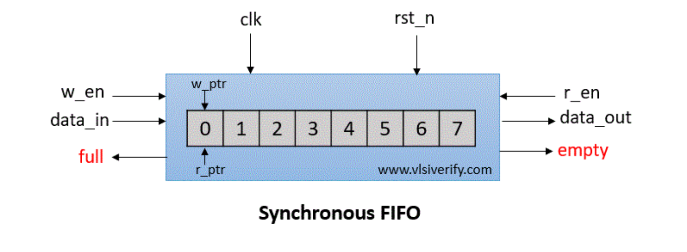
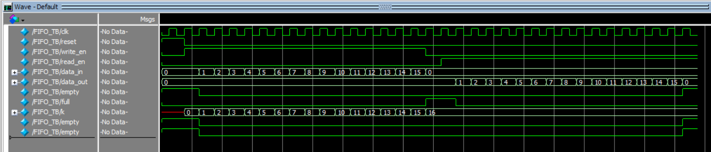
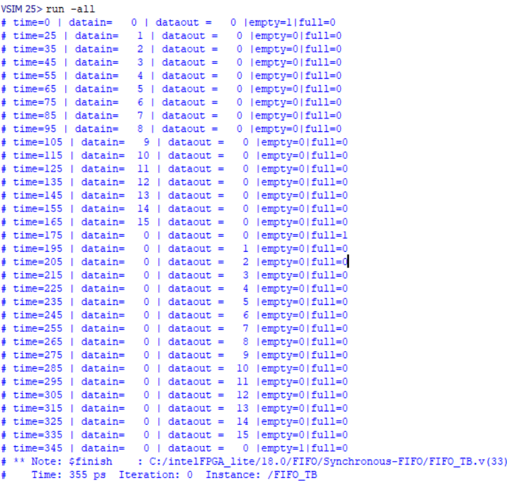

# Synchronous FIFO (First-In-First-Out) Buffer
This project implements a synchronous FIFO buffer where data read and write operations use the same clock frequency. These are usually used with high clock frequency to support high-speed systems.

## 📋 Overview

### What is FIFO?
First In First Out (FIFO) is a very popular and useful design block for purpose of synchronization and a handshaking mechanism between the modules. 

**Depth of FIFO**: The number of slots or rows in FIFO is called the depth of the FIFO.

**Width of FIFO**: The number of bits that can be stored in each slot or row is called the width of the FIFO.

### Types of FIFOs
1. **Synchronous FIFO** - Single clock domain (this implementation)
2. **Asynchronous FIFO** - Multiple clock domains
 
## 📐 Block Diagram

## 🔧 Specifications

| Parameter | Value |
|-----------|-------|
| Data Width (FIFO Width) | 8 bits |
| FIFO Depth | 16 locations |
| Address Width | 4 bits |
| Clock Domain | Single (Synchronous) |
| Reset Type | Asynchronous Active High |

## 🎯 Synchronous FIFO Operation

### FIFO Write Operation
FIFO can store/write the `wr_data` at every positive edge of the clock based on `wr_en` signal till it is full. The write pointer gets incremented on every data write in FIFO memory.

### FIFO Read Operation
The data can be taken out or read from FIFO at every positive edge of the clock based on the `rd_en` signal till it is empty. The read pointer gets incremented on every data read from FIFO memory.

## 📊 Simulation Results

### Waveform Output

The waveform shows the complete operation of the FIFO including:
- Write operations with incrementing write pointer
- Read operations with incrementing read pointer
- Full and Empty flag assertions
- Data flow through the FIFO

### Detailed Output Table

The output table displays:
- **Time**: Simulation time stamps
- **data_in**: Input data values being written
- **data_out**: Output data values being read
- **empty**: Empty flag status throughout simulation
- **full**: Full flag status throughout simulation
- **wr_ptr & rd_ptr**: Pointer positions during operation

## 📚 EDA TOOLS
- **ModelSim/QuestaSim** - Industry standard simulator (used)
- **Icarus Verilog** - Open-source option
- **GTKWave** - Waveform viewer (for Icarus)
- **Xilinx Vivado** - For FPGA synthesis (optional)

## 🧩 References & Resources

- *Digital Design and Computer Architecture* — David Harris & Sarah Harris  
- *Verilog HDL* — Samir Palnitkar  
- [ModelSim User Manual – Intel/Siemens EDA Docs](https://www.intel.com/content/www/us/en/docs/programmable/683130)

